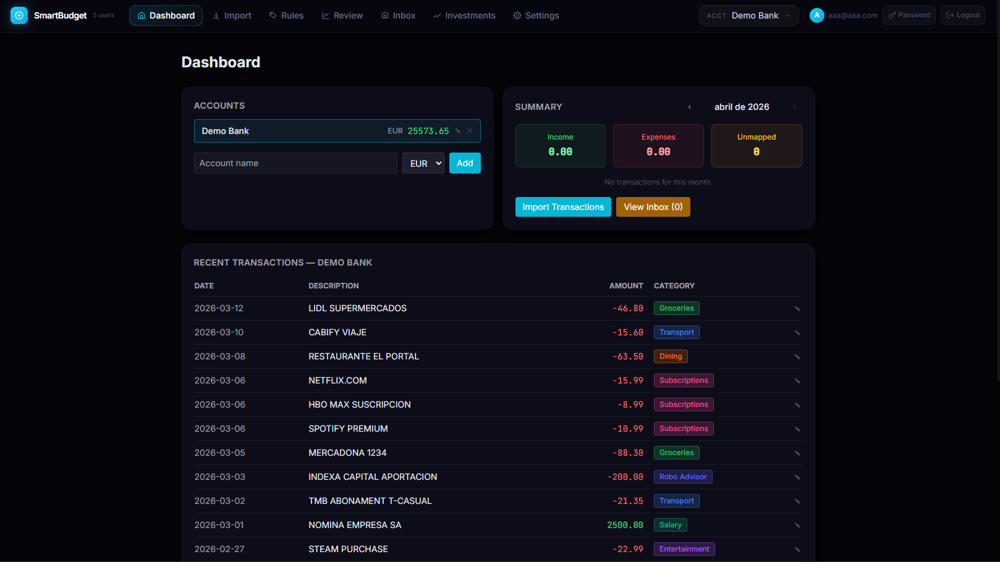
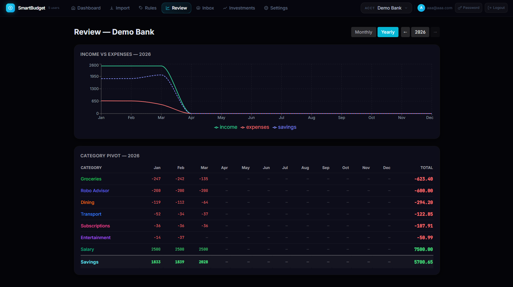
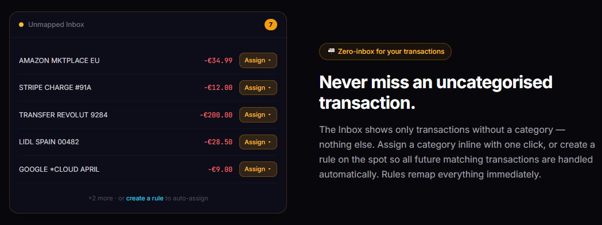
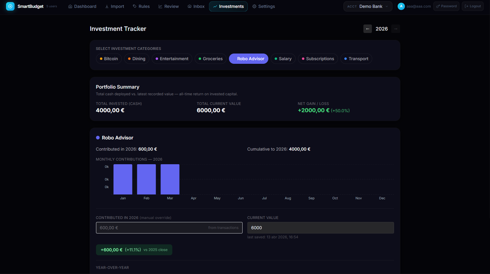

<div align="center">

# SmartBudget Tracker

**Self-hosted personal finance tracker — import any bank CSV, auto-categorise with smart rules, review spending, and track your investment portfolio. Your data stays on your server.**

[](https://github.com/VictorPiella/smart-budget/actions/workflows/docker-publish.yml)
[](https://victorpiella.github.io/smart-budget/)
[](#tech-stack)
[](LICENSE)

[**Live Landing Page →**](https://victorpiella.github.io/smart-budget/)

</div>

---

## Screenshots

<table>
  <tr>
    <td align="center"><b>Dashboard</b></td>
    <td align="center"><b>Review — Yearly Pivot</b></td>
  </tr>
  <tr>
    <td></td>
    <td></td>
  </tr>
  <tr>
    <td align="center"><b>Inbox — Unmapped Triage</b></td>
    <td align="center"><b>Investment Tracker</b></td>
  </tr>
  <tr>
    <td></td>
    <td></td>
  </tr>
</table>

> **Add screenshots:** Take a browser screenshot of each page and save them in `docs/screenshots/` with the filenames above.

---

## Features

| Area | What you get |
|------|-------------|
| **Multi-account** | Unlimited accounts (e.g. "BBVA", "Amex"). Categories, rules, and balances are fully isolated per account. |
| **CSV Import** | Upload a file or paste raw CSV. Auto-detects date, description, and amount columns. Optional extra-description column. Deduplication via SHA-256 checksum — re-import safely. |
| **Smart Rules** | `Contains`, `Exact`, `Starts With`, or `Regex` patterns with priority ordering. Rules fire automatically on every import and on manual Remap. |
| **Unmapped Inbox** | Zero-inbox triage: assign a category inline or create a rule directly from the transaction description. New rule triggers an immediate remap. |
| **Review** | Income vs Expenses line chart (income / expenses / savings lines). Yearly pivot table (categories × 12 months). Click any month header or cell to drill into the paginated monthly transaction list with inline editing. |
| **Manual overrides** | Manually assigned categories are flagged `is_manual` (shown as **M** badge) and protected from auto-remap. Reset with `PATCH { "is_manual": false }`. |
| **Exclude from totals** | Mark a category (e.g. "Credit card payment") as excluded — omitted from the income/expense chart and shown at 50% opacity in the pivot, so transfers don't pollute your analysis. |
| **Investment Tracker** | Select investment categories, enter year-end portfolio values and cash contributions (manual or from transactions). Year-over-year table with annual gain/loss and % return. Monthly contribution bar chart per category. |
| **Settings** | Manage your profile. GDPR account deletion (requires password confirmation). |
| **Auth** | Email + password with bcrypt. Email verification on register. Magic-link (passwordless) login. Change password from the UI. JWT tokens (8 h expiry). |
| **Bot-friendly API** | JSON endpoint to push transactions programmatically from scripts, bots, or scrapers. |

---

## Tech Stack

| Layer | Technology |
|-------|------------|
| Backend | Python 3.12, FastAPI 0.111, SQLAlchemy 2.0, Pydantic v2 |
| Database | PostgreSQL 15 |
| Frontend | React 18, React Router 6, Tailwind CSS 3, Recharts, Axios |
| Reverse proxy | Nginx (Alpine) |
| Container | Docker + Docker Compose |
| CI/CD | GitHub Actions → Docker Hub + GitHub Pages |

---

## Quick Start (Development)

### Prerequisites
- [Docker Desktop](https://www.docker.com/products/docker-desktop/) (includes Docker Compose)
- Git

```bash
# 1. Clone
git clone https://github.com/VictorPiella/smart-budget.git
cd smart-budget

# 2. (Optional) configure environment — defaults work for local dev
cp .env.example .env

# 3. Start
docker compose up --build
```

| Service | URL |
|---------|-----|
| App (via Nginx) | http://localhost |
| Frontend direct | http://localhost:3001 |
| Backend API | http://localhost:8000 |

> **Hot-reload:** Both backend (uvicorn `--reload`) and frontend (CRA dev server) support hot-reload out of the box.

---

## Deployment (Production)

### Prerequisites
- A Linux server with Docker + Docker Compose installed
- A [Docker Hub](https://hub.docker.com/) account
- This repo on GitHub with the following secrets/variables:

| Secret / Variable | Value |
|-------------------|-------|
| `DOCKER_USER` | Your Docker Hub username |
| `DOCKER_TOKEN` | Docker Hub Personal Access Token (Read, Write, Delete) |
| `PROD_HOST` | Your server's IP or hostname |
| `PROD_SSH_KEY` | Private SSH key for your server |
| `DEPLOY_ENABLED` | Repository **variable** set to `true` to enable auto-deploy |

### CI/CD Flow

Every push to `master` triggers three parallel jobs:

```
push to master
├── build-and-push  →  Docker Hub  (smart-budget:latest + :sha)
├── deploy-pages    →  GitHub Pages (landing page, REACT_APP_GH_PAGES=true)
└── deploy          →  SSH into server, docker compose pull && up -d  [if DEPLOY_ENABLED=true]
```

### Deploy on your server

```bash
# Copy files to your server
scp docker-compose.prod.yml .env.example user@your-server:~/smartbudget/

# SSH in and configure
ssh user@your-server
cd ~/smartbudget
cp .env.example .env
nano .env   # Fill in all values — no defaults in prod!

# Pull and start
docker compose -f docker-compose.prod.yml pull
docker compose -f docker-compose.prod.yml up -d
```

### Environment variables

| Variable | Description |
|----------|-------------|
| `POSTGRES_USER` | Database username |
| `POSTGRES_PASSWORD` | Database password — use a strong random value |
| `POSTGRES_DB` | Database name |
| `SECRET_KEY` | JWT signing key — `openssl rand -hex 32` |
| `ALLOWED_ORIGINS` | Comma-separated allowed CORS origins (e.g. `https://yourdomain.com`) |
| `SMTP_HOST` | SMTP server hostname (for email verification + magic links) |
| `SMTP_PORT` | SMTP port (default 587) |
| `SMTP_USER` | SMTP username |
| `SMTP_PASS` | SMTP password |
| `SMTP_FROM` | From address for outbound emails |
| `APP_URL` | Public URL of your app (used in email links) |

---

## GitHub Pages (Landing Page)

The landing page is automatically deployed to **[victorpiella.github.io/smart-budget](https://victorpiella.github.io/smart-budget/)** on every push to `master`.

Built with `REACT_APP_GH_PAGES=true` — login/register links are hidden since there is no backend on GitHub Pages. The CTA becomes a **View on GitHub** link instead.

**To activate on a fork:**
1. Go to **Settings → Pages**
2. Source: **Deploy from a branch** → branch `gh-pages` → `/ (root)`

---

## Project Structure

```
smart-budget/
├── backend/
│   ├── app/
│   │   ├── main.py          # FastAPI routes + startup migrations + mapping engine
│   │   └── models.py        # SQLAlchemy models
│   ├── Dockerfile           # Dev image (uvicorn --reload)
│   └── Dockerfile.prod      # Production image (uvicorn, 2 workers)
├── frontend/
│   ├── public/
│   │   ├── index.html       # SPA entry + GitHub Pages redirect handler
│   │   └── 404.html         # GitHub Pages deep-link redirect
│   └── src/
│       ├── api.js            # Axios instance (baseURL=/api, Bearer token)
│       ├── context/
│       │   ├── AccountContext.js   # Global account state
│       │   └── AuthContext.js      # JWT auth state
│       ├── components/
│       │   └── Layout.js    # Top-bar nav, account picker, change-password modal
│       └── pages/
│           ├── LandingPage.js      # Marketing page (also deployed to GitHub Pages)
│           ├── DashboardPage.js    # Account list, monthly summary, inline tx editing
│           ├── ImportPage.js       # 2-step CSV import
│           ├── InboxPage.js        # Unmapped transaction triage
│           ├── ReviewPage.js       # Line chart + yearly/monthly pivot with inline edit
│           ├── RulesPage.js        # Category & rule management
│           ├── InvestmentPage.js   # Portfolio tracker + year-over-year table
│           └── SettingsPage.js     # Profile + account deletion
├── nginx/
│   ├── nginx.conf           # Dev proxy config
│   └── nginx.prod.conf      # Production SPA config
├── docs/
│   └── screenshots/         # README screenshots (add your own)
├── .github/workflows/
│   └── docker-publish.yml   # CI: Docker Hub + GitHub Pages on push to master
├── docker-compose.yml        # Development stack
├── docker-compose.prod.yml   # Production stack
└── .env.example              # Environment variable template
```

---

## API Reference

All endpoints require `Authorization: Bearer <token>` unless noted.

### Auth

| Method | Path | Body | Notes |
|--------|------|------|-------|
| `POST` | `/api/auth/register` | `{ email, password }` | Creates user, sends verification email |
| `POST` | `/api/auth/login` | form: `username=&password=` | Returns `{ access_token }` |
| `POST` | `/api/auth/change-password` | `{ current_password, new_password }` | |
| `POST` | `/api/auth/forgot-password` | `{ email }` | Sends magic-link reset email |
| `POST` | `/api/auth/verify-magic-link` | `{ token }` | Passwordless login via emailed token |
| `POST` | `/api/auth/verify-email` | `{ token }` | Confirms email address |
| `DELETE` | `/api/auth/me` | `{ password }` | GDPR erasure — requires password confirmation |

### Accounts

| Method | Path | Notes |
|--------|------|-------|
| `GET` | `/api/accounts` | Balance computed from transaction SUM |
| `POST` | `/api/accounts` | `{ name, currency }` |
| `PATCH` | `/api/accounts/{id}` | `{ name?, currency? }` |
| `DELETE` | `/api/accounts/{id}` | Cascades to all account data |

### Transactions

| Method | Path | Notes |
|--------|------|-------|
| `GET` | `/api/accounts/{id}/transactions` | `?year=&month=&unmapped_only=true&page=&per_page=` |
| `PATCH` | `/api/accounts/{id}/transactions/{txn_id}` | `{ date?, raw_description?, amount?, category_id?, is_manual? }` |
| `DELETE` | `/api/accounts/{id}/transactions/{txn_id}` | |

### Categories & Rules

```
GET / POST        /api/accounts/{id}/categories
PATCH / DELETE    /api/accounts/{id}/categories/{cat_id}

GET / POST        /api/accounts/{id}/rules
PATCH / DELETE    /api/accounts/{id}/rules/{rule_id}

POST              /api/accounts/{id}/remap      # Re-run mapping engine on all transactions
```

### Import

```
POST /api/accounts/{id}/import/preview   # Auto-detect columns from CSV
POST /api/accounts/{id}/import           # Full CSV import (multipart)
POST /api/accounts/{id}/import/auto      # Bot-friendly JSON import
```

### Review & Investments

```
GET /api/accounts/{id}/summary?year=                       # Monthly chart + pivot data
GET /api/accounts/{id}/investment-summary?category_ids=    # All-years portfolio data
PUT /api/accounts/{id}/investment-snapshots                # Save year-end value / contribution
```

---

## Bot / Auto-Import API

Push transactions programmatically from PDF parsers, bank scrapers, or any external script.

```bash
# 1. Get a token
curl -X POST https://your-server/api/auth/login \
  -H "Content-Type: application/x-www-form-urlencoded" \
  -d "username=you@example.com&password=yourpassword"
# → { "access_token": "eyJ..." }

# 2. Find your account ID
curl https://your-server/api/accounts \
  -H "Authorization: Bearer eyJ..."
# → [{ "id": "uuid", "name": "BBVA", ... }]

# 3. Push transactions
curl -X POST https://your-server/api/accounts/{id}/import/auto \
  -H "Authorization: Bearer eyJ..." \
  -H "Content-Type: application/json" \
  -d '{
    "transactions": [
      { "date": "2026-04-01", "description": "NETFLIX.COM", "amount": -15.99 },
      { "date": "2026-04-03", "description": "SALARY ACME CORP", "amount": 3500.00 }
    ]
  }'
# → { "total_rows": 2, "imported": 2, "skipped_duplicates": 0 }
```

**Contract:** `date` = ISO `YYYY-MM-DD` · `amount` negative = expense · re-sending is safe (deduplication via SHA-256 checksum) · mapping rules fire automatically.

---

## Architecture Notes

**No migrations framework** — `main.py` runs idempotent `ALTER TABLE … ADD COLUMN IF NOT EXISTS` at every container start.

**Balance** is always computed as `SUM(transactions.amount)` live — the stored column value is never used.

**Deduplication** via SHA-256 of `date|amount|description` (lowercase, stripped). Only recomputed on `PATCH` if date/description/amount fields change.

**Mapping engine** evaluates rules in descending priority order — first match wins, always case-insensitive.

**`exclude_from_totals`** categories are omitted from the income/expense chart and shown at 50% opacity in the pivot table, but still reflected in the real account balance.

**`is_manual`** transactions survive remap — manually assigned categories are never overwritten by the rule engine.

---

## Security

| Control | Implementation |
|---------|---------------|
| Passwords | bcrypt hashing via passlib |
| Tokens | JWT (HS256), 8 h expiry |
| Login timing | Dummy bcrypt hash run even when email not found — prevents user enumeration |
| Rate limiting | slowapi: 5/min on login, register, magic-link/forgot |
| Input validation | Pydantic v2 — hex color regex, max-length on names/patterns, currency format |
| Account deletion | Requires password re-confirmation |
| CORS | Configurable `ALLOWED_ORIGINS`; credentials allowed only for listed origins |
| Security headers | `X-Frame-Options: DENY`, `X-Content-Type-Options: nosniff`, `Referrer-Policy`, `CSP` via nginx |
| Email | Verification required before first login; magic-link tokens are single-use with 1 h expiry |

> HTTPS is not handled by this repo — configure TLS at your reverse proxy (e.g. Let's Encrypt via Certbot or Caddy).

---

## License

MIT — use freely, modify as you like.
